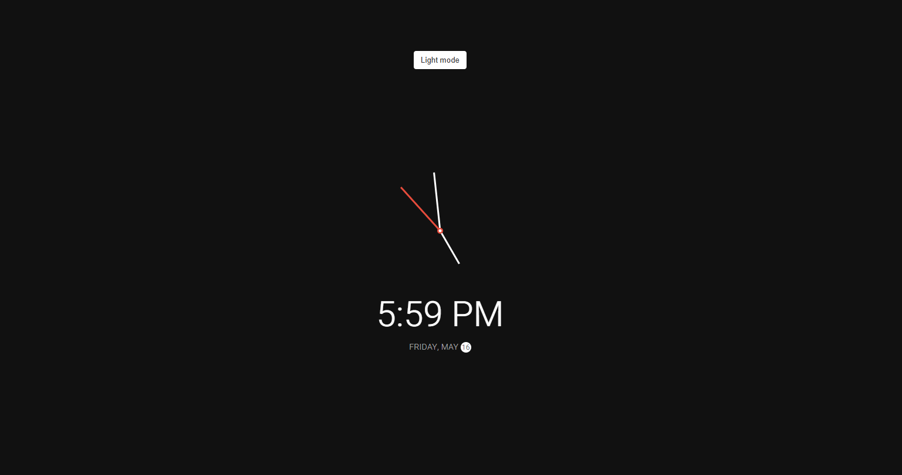
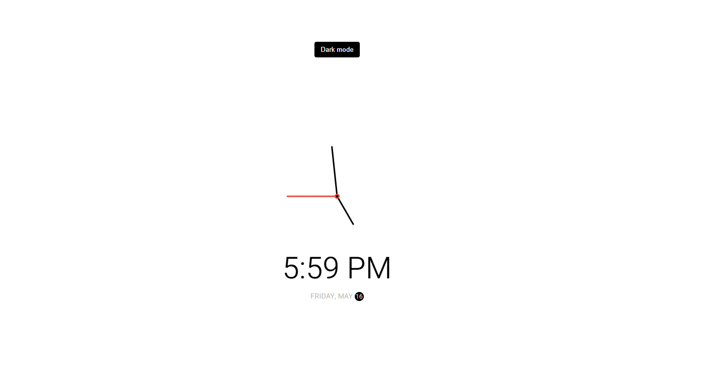

<h1 align="center">⏰ Theme Clock</h1>

<p align="center">
  
</p>

<p align="center">
  A visually appealing analog + digital clock with a light/dark theme toggle, built using HTML, CSS, and JavaScript.
</p>

<p align="center">
  <a href="https://garimaakashyap.github.io/Theme-Clock/">🌐 Live Demo</a> |
  <a href="#features">✨ Features</a> |
  <a href="#tech-stack">🛠️ Tech Stack</a> |
  <a href="#getting-started">🚀 Getting Started</a> |
  <a href="#screenshots">📸 Screenshots</a> |
  <a href="#license">📄 License</a>
</p>

---

## 📌 About the Project

The **Theme Clock** is a modern and minimalistic web clock that displays the current time and date using both analog and digital formats. It comes with a light/dark theme toggle for a better user experience. This project is ideal for learning DOM manipulation, time-based functions, and theme switching with CSS variables.

---

## ✨ Features

✔️ Live analog clock with hour, minute, and second hands  
✔️ Digital time display with AM/PM format  
✔️ Dynamic date display  
✔️ Toggle between dark and light mode  
✔️ Smooth transitions using CSS and JavaScript  
✔️ Minimal and responsive design  

---

## 🖼️ Demo Preview

🔗 **Live Demo**: [Click here to try the app now!](https://garimaakashyap.github.io/Theme-Clock/)

<p align="center">
  
</p>

---

## 🛠️ Tech Stack

| Technology     | Description                                  |
|----------------|----------------------------------------------|
| HTML5          | Markup structure                             |
| CSS3           | Styling, layout, and theme transition        |
| JavaScript     | Time logic, DOM updates, and toggle handling |
| Google Fonts   | Custom font (`Heebo`)                        |

---

## 🚀 Getting Started

Follow these steps to run the project locally:

### 📁 Clone the Repository

```bash
git clone https://github.com/garimaakashyap/Theme-clock.git
cd theme-clock
```
---
## Contact

- **GeeksforGeeks Profile**: [Your gfg](https://www.geeksforgeeks.org/user/garimamillicent/)
- **LinkedIn**: [Your LinkedIn](https://www.linkedin.com/in/garima-kashyap-75b1202b8/)
- **GitHub**: [Your GitHub](https://github.com/garimaakashyap)

